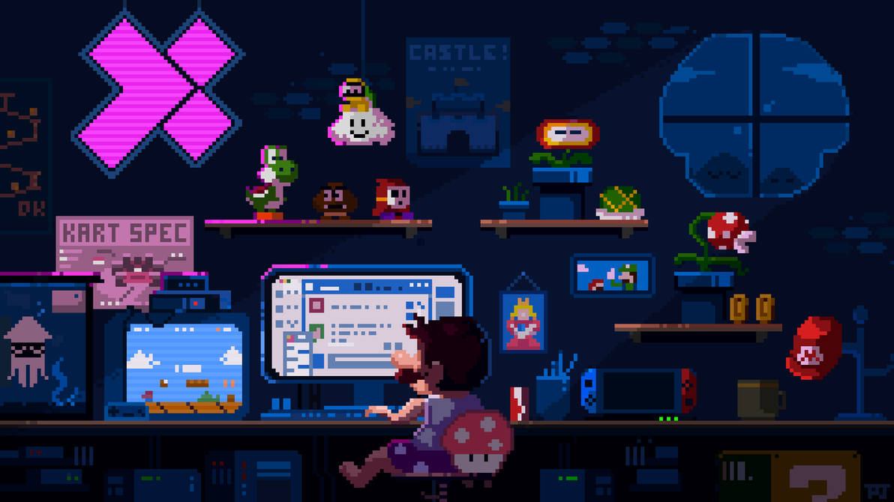

<h1 align="center">Hi 👋, I'm Suraj Gupta</h1>
<h3 align="center">A passionate frontend developer from India</h3>
<!--  -->

  

<!-- 
  
 -->

- 🔭 I’m currently working on **my secret project.**

- 🌱 I’m currently learning **backend devlopment**

- 👯 I’m looking to collaborate on **UI/UX Designs.**

- 🤝 I’m looking for help with **some freelancing projects.**

- 💬 Ask me about **Ethical Hacking, Iot and Figma.**

- 📝 I write articles on [www.suraj's/notepad.com](https://surajkr97.hashnode.dev)

- 📫 How to reach me **surajkr97@icloud.com**

- ⚡ Fun fact **It’s all 0’s and 1’s**

<h3 align="left">Connect with me:</h3>

<h3 align="left">Languages and Tools:</h3>

               

&nbsp;

